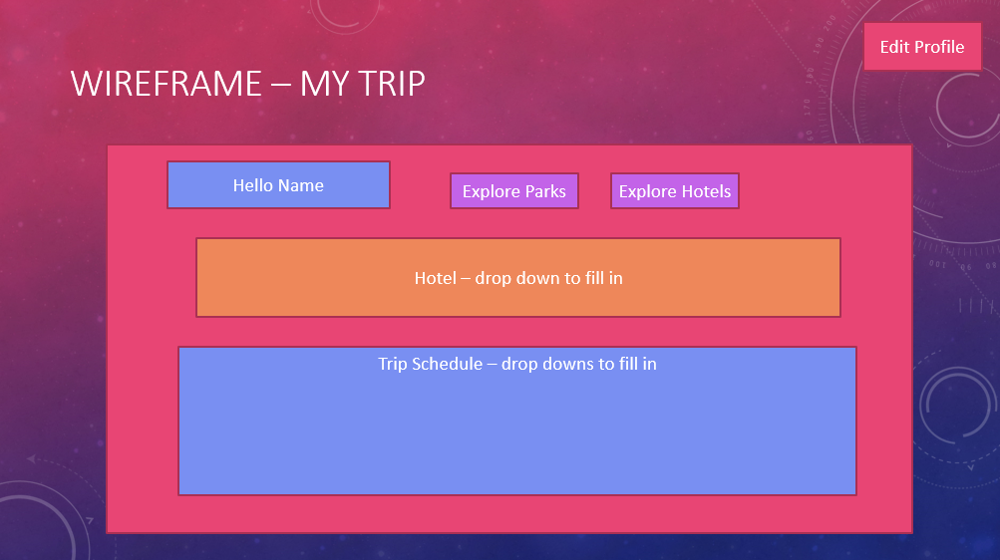
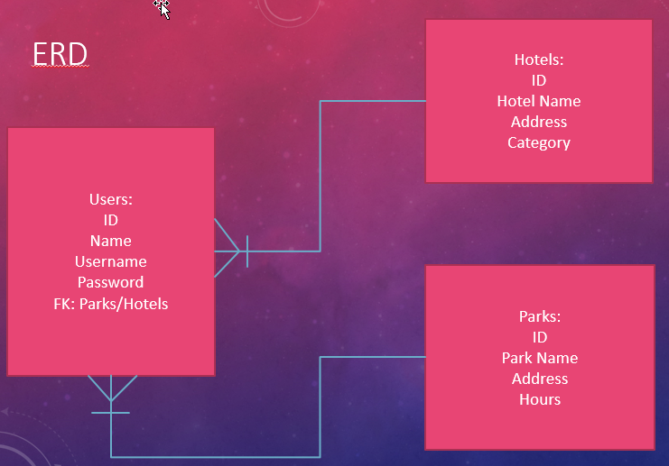

# Disney Travel App || Margie Ball

### Link to the App
[Disney App](https://margenta2.github.io/disneytravel.github.io/)

### Description
This is an application to help a user plan their trip to Disney World. They will be able to review hotel and park details and select a hotel and park for their profile.

### Technologies Used
* Express
* Node JS
* Sequelize
* EJS
* Google Chrome
* PostgreSQL

### Existing Features
* Users can create, access, update and delete their profiles
* Users can explore Disney hotel and park information
* Users can add a hotel and park to their profile

### Planned Features
* Add ability for users to add multiple parks and hotels to profile
* Give user ability to add dates and display customized itinerary

### Wireframe

### ERD

### Installation Instructions
1. Fork and clone project repository
2. Install dependencies
  * Express
  * EJS
  * Method-Override
  * Body-Parser
  * Sequelize-CLI
  * Sequelize
  * PG
3. Ensure PostgreSQL is running and set up database
4. Start up server and navigate to indicated port number

### Resources
* StackOverflow
* Fellow Teammates
* GA Instructors(Thank you Leo!)
* GA Lesson Repositories
* [Guide to FlexBox](https://css-tricks.com/snippets/css/a-guide-to-flexbox/)

